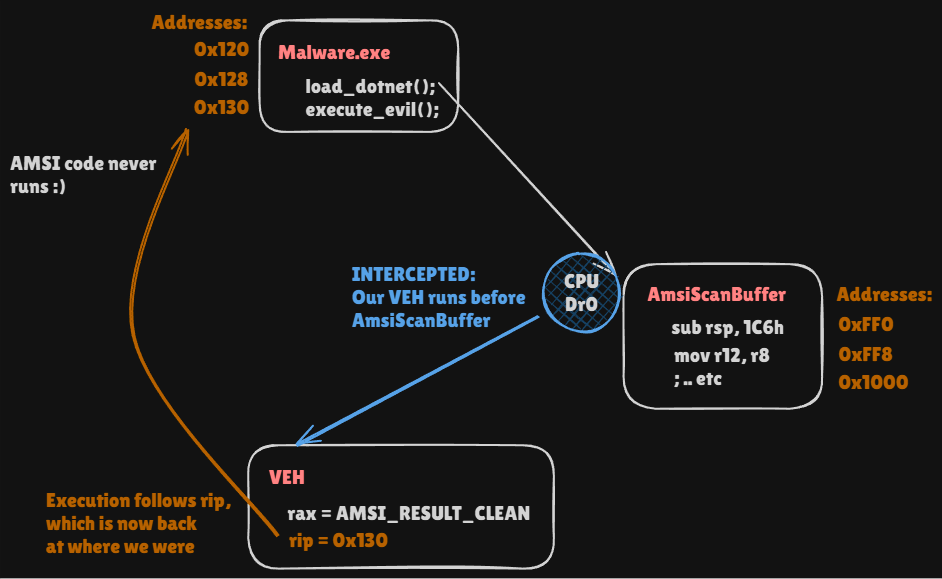

# Vectored Exception Handling Squared

A Rust Proof of Concept. Read more on my [blog](https://fluxsec.red/vectored-exception-handling-squared-rust), all original research by [CrowdStrike](https://www.crowdstrike.com/en-us/blog/crowdstrike-investigates-threat-of-patchless-amsi-bypass-attacks/), this is just the POC for it!

Unless I am blind; there does not seem to be much out there (POC's etc) relating to 
the [discovery made by CrowdStrike researchers](https://www.crowdstrike.com/en-us/blog/crowdstrike-investigates-threat-of-patchless-amsi-bypass-attacks/),
called Vectored Exception Handling Squared, or VEH². I want to say though, I do think
it's really cool that CrowdStrike published this research - I would love to see more like this! My personal mantra for what
I do is: from offense comes better, deeper, defence.

Here is a visual for what is going on:

